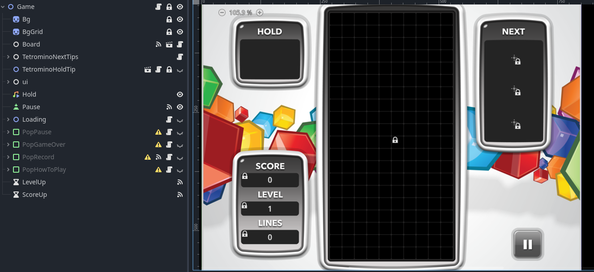
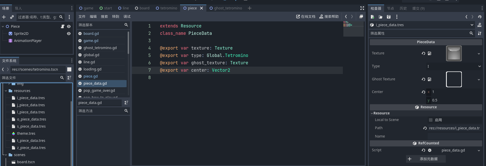
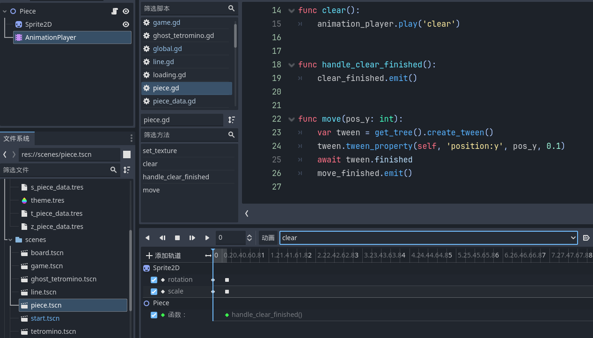

# 一个使用godot做的俄罗斯方块Demo游戏
> 仿照 [tetris](https://tetris.com/play-tetris) ,只做了一些必须的部分，有些游戏玩法和动画没有做出来，（难）
## 主要玩法
- Q，左旋
- E，右旋
- S，下落
- Space，快速下落
- 鼠标右键，切换Hold
## 场景
- start，开始部分的场景
- game，游戏主场景
- board，主要逻辑节点
- piece，封装俄罗斯方块的最小单元
- line，封装的行
- tetromino，封装的俄罗斯方块
- tetroino_tip，封装的提示
## 全局单例
## 自定义控件样式
## 场景树

## 关键点
### 程序生成不同形状  

> 参照`tetromino.gd 的 init()`  
注意：需要将节点添加到场景树后（也就是add_child），再对子节点进行操作，不然会提示Null的错误

> tetromino的配置信息在tres的资源文件中

### tetromino的平移旋转变换

> 参照`tetromino.gd 的 transform_pieces()`

### 判断该行填充完整

> tetromino下落锁定后，会将piece的父节点改为line，然后再判断line的piece节点个数是否达到最大列数

### 完整行的消除，与上行下落

> 通过多个piece的动画结束后的信号通知，来判断该行piece动画全部结束

### piece消除动画后的信号通知

使用AnimatePlayer节点来控制动画，以及结束后的通知
